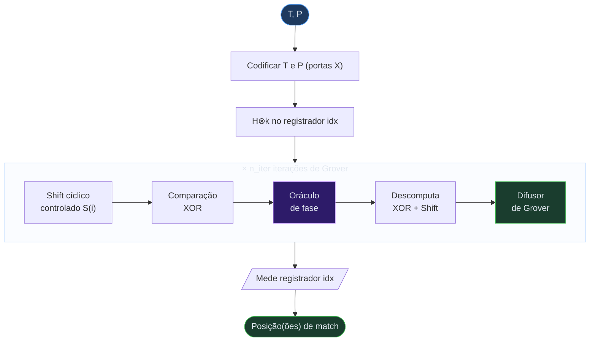
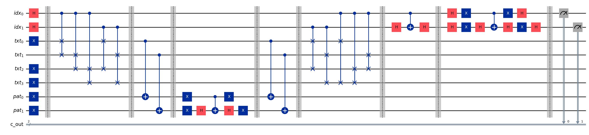
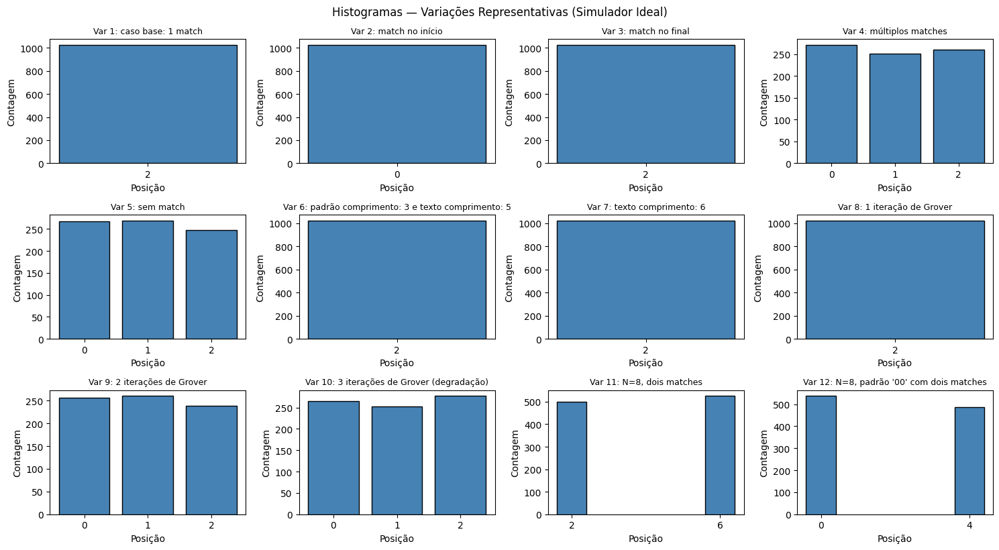
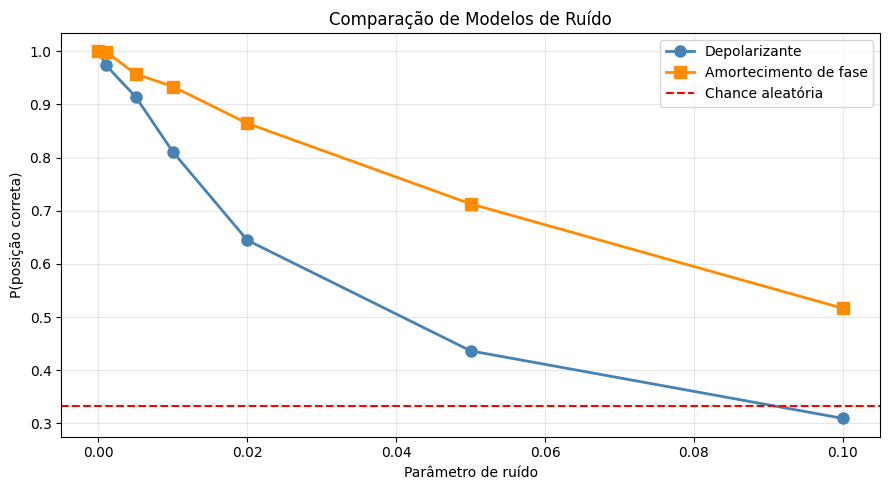
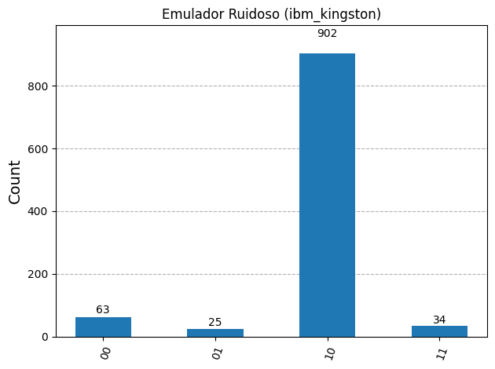
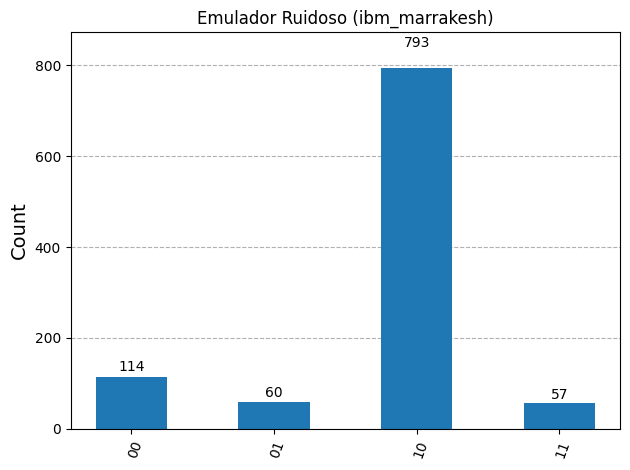
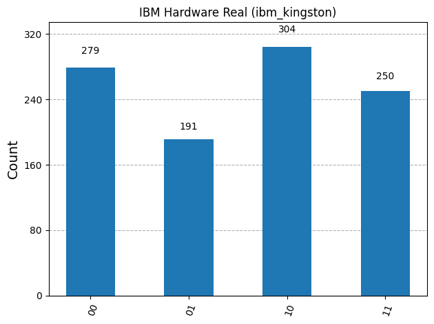
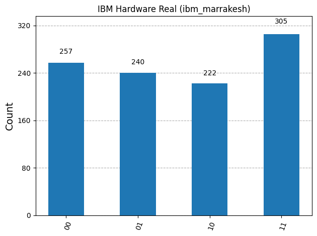

<div class="cover-glow" />

<div class="cover-grid" />

<h1 class="cover-title">Quantum String Matching</h1>

<p class="cover-paper">
  Niroula & Nam, <em>npj Quantum Information</em> <strong>7</strong>, 37 (2021)
</p>

<div class="cover-team">
  <div class="team-member blue">
    <span class="name">Pedro Gabriel Alves da Silva</span>
    <span class="id">pgas@cin.ufpe.br</span>
  </div>
  <div class="team-divider" />
  <div class="team-member purple">
    <span class="name">Ricardo Morato Rocha</span>
    <span class="id">rmr@cin.ufpe.br</span>
  </div>
</div>

<p class="cover-meta">Equipe 5, Computação Quântica, 2026.1</p>

---

# Roteiro

<div class="agenda">

<v-click>
<div class="agenda-item">
  <span class="num">01</span>
  <span class="title">Apresentação do Algoritmo</span>
  <span class="desc">O problema de busca de padrão -> Niroula & Nam (2021), arquitetura e componentes</span>
</div>
</v-click>

<v-click>
<div class="agenda-item">
  <span class="num">02</span>
  <span class="title">Metodologia</span>
  <span class="desc">Implementação em Qiskit -> 8 qubits, 12 variações de circuito</span>
</div>
</v-click>

<v-click>
<div class="agenda-item">
  <span class="num">03</span>
  <span class="title">Resultados</span>
  <span class="desc">Testes com ruído -> Simuladores IBM Quantum</span>
</div>
</v-click>

<v-click>
<div class="agenda-item">
  <span class="num">04</span>
  <span class="title">Conclusões</span>
  <span class="desc">Síntese dos resultados e aprendizados</span>
</div>
</v-click>

</div>

---
layout: section
class: text-center
---

<div class="section-label">parte 01</div>

# Apresentação do Algoritmo

---
layout: two-cols
---

## Busca de Padrão em Texto

Dado texto $T$ (comprimento $N$) e padrão $P$ (comprimento $M$),
encontrar **se $P$ ocorre em $T$**.

<div class="example-box mt-5">

```
T = "1 0 1 1 0 1 1 0"
         ↑       ↑
P = "1 1"

Match em i = 2  e  i = 5
```

</div>

<v-click>

### Complexidade Clássica

<div class="complexity-table mt-4">
  <div class="crow header">
    <span>Algoritmo</span>
    <span>Complexidade</span>
  </div>
  <div class="crow">
    <span>Força bruta</span>
    <span class="mono">O(N · M)</span>
  </div>
  <div class="crow">
    <span>KMP</span>
    <span class="mono">O(N + M)</span>
  </div>
  <div class="crow">
    <span>Boyer-Moore</span>
    <span class="mono">O(N/M) (no melhor caso)</span>
  </div>
</div>

</v-click>

::right::

<v-click>

## O Salto Quântico

<div class="speedup-visual">
<div class="sp-box classical">
<div class="sp-label">Clássico</div>
<div class="sp-val">

$O(N + M)$

</div>
</div>
<div class="sp-arrow">⟶</div>
<div class="sp-box quantum">
<div class="sp-label">Quântico</div>
<div class="sp-val">

$\tilde{O}(\sqrt{N})$

</div>
<div class="sp-tag">✦ aceleração quadrática</div>
</div>
</div>

</v-click>

<v-click>

<div class="insight mt-6">
  <div class="insight-icon">💡</div>
  <div>
    Em vez de testar cada posição <em>i</em> <em>sequencialmente</em>,
    colocamos <strong>todas as posições em superposição</strong>
    e aplicamos o oráculo de Grover para amplificar o match.
  </div>
</div>

</v-click>

---

## Por que Niroula & Nam (2021)?

<v-click>
<div class="compare-row mt-4">
<div class="compare-box neg">
  <div class="compare-header">❌ Ramesh & Vinay (2000)</div>
  <ul>
    <li>Descreve apenas <strong>complexidade de oráculo</strong></li>
    <li>Não fornece construção de circuito</li>
    <li>Referência muito teórica, não muito prática</li>
    <li>Tivemos muita dificuldade de implementar com o Qiskit</li>
  </ul>
</div>
<div class="compare-box pos">
  <div class="compare-header">✅ Niroula & Nam (2021)</div>
  <ul>
    <li>Implementação explícita em <strong>nível de portas</strong></li>
    <li>Pseudocódigo bem detalhado no artigo</li>
    <li>Baseado em portas simples disponíveis no Qiskit</li>
    <li>Possui passo a passo no artigo</li>
  </ul>
</div>
</div>
</v-click>

<v-click>

<div class="key-fact mt-4">
  <div class="kf-icon">📐</div>
  <div>
    <strong>Complexidade:</strong><br>

  $\tilde{O}(\sqrt{N})$ para 1 match
  $\tilde{O}(\sqrt{N} + \sqrt{kN})$ para todos os $k$ matches<br>
  Espaço: $O(N + M)$

  </div>
</div>

</v-click>

---

## Arquitetura de 3 Registradores

<div class="reg-diagram">

  <div class="reg idx">
    <div class="reg-title">Registrador de Índice</div>
    <div class="reg-qubits">
      <div class="q blue">q₀</div>
      <div class="q blue">q₁</div>
      <div class="q-dots">⋯</div>
    </div>
    <div class="reg-desc">
      <strong><em>k</em> = ⌈log₂(N−M+1)⌉ qubits</strong><br>
      Superposição uniforme de todas as<br>
      posições de início |<em>i</em>⟩, <em>i</em> ∈ {0,…,N−M}
    </div>
  </div>

  <div class="reg-sep">→</div>

  <div class="reg txt">
    <div class="reg-title">Registrador de Texto</div>
    <div class="reg-qubits">
      <div class="q purple">t₀</div>
      <div class="q purple">t₁</div>
      <div class="q purple">t₂</div>
      <div class="q purple">t₃</div>
    </div>
    <div class="reg-desc">
      <strong><em>N</em> qubits</strong><br>
      Codifica o texto completo <em>T</em><br>
      Porta <code>X</code> onde T[j] = 1
    </div>
  </div>

  <div class="reg-sep">→</div>

  <div class="reg pat">
    <div class="reg-title">Registrador de Padrão</div>
    <div class="reg-qubits">
      <div class="q green">p₀</div>
      <div class="q green">p₁</div>
    </div>
    <div class="reg-desc">
      <strong><em>M</em> qubits</strong><br>
      Codifica o padrão <em>P</em><br>
      Usado para comparação via XOR
    </div>
  </div>

</div>

<div class="reg-example">

**Exemplo concreto:** &nbsp;$T =$ `"1011"` $(N=4)$, &nbsp;$P =$ `"11"` $(M=2)$ &nbsp;→&nbsp; $2 + 4 + 2 =$ **8 qubits** no total &nbsp;

</div>

---
layout: two-cols
---

## Operador de Deslocamento Cíclico

A **contribuição central** de Niroula & Nam: o operador $S(c)$ que rotaciona ciclicamente o registrador de texto controlado pelo índice.

<v-click>

**Deslocamento esquerdo por $c$ posições:**

$$S(c)\,|t_0\,t_1\,\cdots\,t_{N-1}\rangle = |t_c\,t_{c+1}\,\cdots\,t_{N-1}\,t_0\,\cdots\,t_{c-1}\rangle$$

</v-click>

<v-click>

**Superposição controlada:**

$$\sum_{i=0}^{N-M} |i\rangle|T\rangle \;\xrightarrow{S}\; \sum_{i} |i\rangle\,S(i)|T\rangle$$

Após o shift, os primeiros $M$ qubits de $|T\rangle$ contêm $T[i\,..\,i{+}M{-}1]$.

</v-click>

::right::

<v-click>

**Implementação via CSWAP:**

```
shift por bit 0 (c=1): CSWAP(idx[0], t[j], t[j+1])
shift por bit 1 (c=2): CSWAP(idx[1], t[j], t[j+2])
...cada bit controla uma camada de SWAPs
```

<div class="cswap-note mt-3">
  A porta CSWAP (também conhecida como porta de Fredkin) possui
  três entradas e três saídas, com um bit de controle e dois bits de destino, que transmite o primeiro bit inalterado e troca os dois últimos bits se, e somente se, o primeiro bit for 1.
</div>

</v-click>

---
layout: two-cols
---

## Oráculo de Fase

Marca com fase $-1$ as posições onde $T[i..i{+}M{-}1] = P$.

<v-click>

**1) Comparação XOR:**

$$\text{CNOT}(q_{txt}[j],\; q_{pat}[j]) \quad \forall\, j \in [0, M)$$

Se $T[i{+}j] = P[j]$ para todo $j$ $\Rightarrow$ $q_{pat} = |0\ldots0\rangle$

</v-click>

<v-click>

**2) Phase kickback em $|0\ldots0\rangle$:**

$$X^{\otimes M} \;\to\; H \cdot MCX \cdot H \;\to\; X^{\otimes M}$$

</v-click>

<v-click>

**3) Descomputa** o XOR e o shift cíclico.

</v-click>

::right::

<v-click>

## Difusor de Grover

Amplifica as amplitudes marcadas no registrador de índice.

$$H^{\otimes k} \to X^{\otimes k} \to MCZ \to X^{\otimes k} \to H^{\otimes k}$$

<div class="diffuser-viz">
  <div class="dv-row before">Estado após oráculo: picos em matches</div>
  <div class="dv-arrow">↓ difusor</div>
  <div class="dv-row after">Amplitudes de match amplificadas</div>
</div>

</v-click>

<v-click>

**Número ótimo de iterações:**

$$n_{iter} = \left\lfloor \frac{\pi}{4} \sqrt{\frac{2^k}{k_{matches}}} \right\rfloor$$

onde $k_{matches}$ é o número de posições de match.

</v-click>

---
class: text-center
---

## Fluxo Completo do Algoritmo



<div class="flow-legend">
  <span class="fl blue">Preparação de estado</span>
  <span class="fl purple">Oráculo quântico</span>
  <span class="fl green">Amplificação + Medição</span>
  <span class="fl dim">Loop de Grover</span>
</div>

---
layout: section
class: text-center
---

<div class="section-label">parte 02</div>

# Metodologia

---
layout: two-cols
---

## Nossa Implementação

**Exemplo base:** $T =$ `"1011"`, $P =$ `"11"`

<div class="stats-row mt-5">
  <div class="stat">
    <div class="stat-n blue">8</div>
    <div class="stat-l">Qubits<br><small>2 idx + 4 txt + 2 pat</small></div>
  </div>
  <div class="stat">
    <div class="stat-n green">1</div>
    <div class="stat-l">Iteração<br><small>⌊π/4·√2⌋ = 1</small></div>
  </div>
  <div class="stat">
    <div class="stat-n purple">pos 2</div>
    <div class="stat-l">Resultado<br><small>T[2..3] = "11"</small></div>
  </div>
</div>

<v-click>

<div class="note-box mt-5">

**Correção de wrap-around:** posições $i \geq N{-}M{+}1$ no espaço $2^k$ podem gerar falsos positivos por comparação circular.

Ou seja, qualquer posição $i \in [N{-}M + 1, N{-}1]$ não é válida.

Cancelamos esses casos com phase flips adicionais antes do difusor.

</div>

</v-click>

::right::

<div class="impl-code">

```python {1-7|9-17|19-29}
  def build_string_match_circuit(
      text: str,
      pattern: str,
      n_iterations: int = None,
  ) -> QuantumCircuit:
      N, M = len(text), len(pattern)
      n_idx = ceil(log2(N - M + 1))

      q_idx  = QuantumRegister(n_idx, "idx")
      q_text = QuantumRegister(N,     "txt")
      q_pat  = QuantumRegister(M,     "pat")
      c_out  = ClassicalRegister(n_idx, "c_out")
      qc = QuantumCircuit(q_idx, q_text, q_pat, c_out)

      encode_string(qc, q_text, text)
      encode_string(qc, q_pat,  pattern)
      qc.h(q_idx)  # superposição uniforme

      for _ in range(n_iterations):
          for bit in range(n_idx):
              controlled_cyclic_shift(
                  qc, q_idx[bit], q_text,
                  (1 << bit) % N)
          # XOR -> oráculo -> unXOR -> unshift
          # correção do wrap-around
          build_grover_diffuser(qc, q_idx)

      qc.measure(q_idx, c_out)
      return qc
```

</div>

---

## Circuito Gerado no Exemplo



<div class="circuit-blocks">
  <div class="note-box">🔁 Preparação de Estado, Shift Cíclico e Phase Kickback</div>
  <div class="compare-box pos">🛜 Uncompute do XOR, Uncompute do Shift, Difusor e Medição</div>
</div>

---

## 12 Variações de Circuito Simulados

<div class="var-table">

| #   | Texto      | Padrão | Iter | Posição esperada                 | Status |
| --- | ---------- | ------ | :--: | -------------------------------- | :----: |
| 1   | `1011`     | `11`   | auto | 2 (match único)                  |   ✅   |
| 2   | `1101`     | `11`   | auto | 0 (início)                       |   ✅   |
| 3   | `0011`     | `11`   | auto | 2 (final)                        |   ✅   |
| 4   | `1111`     | `11`   | auto | 0, 1, 2 (múltiplos)              |   ✅   |
| 5   | `1010`     | `11`   | auto | — (sem match)                    |   ✅   |
| 6   | `10110`    | `110`  | auto | 2 (padrão M=3)                   |   ✅   |
| 7   | `101101`   | `110`  | auto | texto mais longo                 |   ✅   |
| 8   | `1011`     | `11`   |  1   | Ótimo para $T=4$ e $P=2$         |   ✅   |
| 9   | `1011`     | `11`   |  2   | iteração extra                   |   ✅   |
| 10  | `1011`     | `11`   |  3   | super-rotação                    |   ✅   |
| 11  | `00110011` | `11`   | auto | N=8, dois matches                |   ✅   |
| 12  | `11001100` | `00`   | auto | N=8, padrão "00"                 |   ✅   |

</div>

<div class="all-pass">
  ✅ &nbsp;Todos os 12 casos passaram no simulador ideal <strong>AerSampler -> 1024 shots</strong>
</div>

---


## Simulações, Testes e Validações

<div class="reg-diagram">

  <div class="reg idx">
    <div class="reg-title">Simulação Ideal</div>
    <div class="reg-desc">
      <br>
      Simulações abordadas no slide anterior.
      12 variações do circuito, com N e M de tamanhos variados, 1024 shots em cada.
    </div>
  </div>

  <div class="reg-sep">→</div>

  <div class="reg txt">
    <div class="reg-title">Simulação de Ruído</div>
    <div class="reg-desc">
      <br>
      Simulamos tanto o Ruído Depolarizante, quanto o Ruído de Amortecimento de Fase.
      Com esses tipos de ruído, existe a chance de um qubit
      <strong>mudar completamente de estado</strong> ou
      desalinhar qubits, fazendo com que <strong>saiam de superposição</strong>
    </div>
  </div>

  <div class="reg-sep">→</div>

  <div class="reg pat">
    <div class="reg-title">Máquinas IBM Quantum Reais</div>
    <div class="reg-desc">
      <br>
      Utilizando chaves de API da IBM Quantum, nos conectamos com hardware quântico real e conseguimos constatar o efeito do ruído real no algoritmo.
    </div>
  </div>

</div>

<div class="reg-example">
Todos os testes estão disponíveis no repositório da equipe, QR Code ao fim da apresentação.
</div>


---
layout: section
class: text-center
---

<div class="section-label">parte 03</div>

# Resultados

---

## Histogramas das simulações ideais



---

## Ruído Depolarizante e Amortecimento de Fase



<div class="reg-example">
Em nossos testes, o algoritmo se provou mais robusto ao amortecimento de fase do que ao ruído depolarizante. Para γ = 0.10, a probabilidade de acerto ainda é aproximadamente 55%, enquanto o ruído depolarizante no mesmo nível reduz a probabilidade para 31%.
</div>

---
layout: two-cols
---

## IBM Quantum (Execução Real)

Executamos o mesmo circuito em **dois backends reais** da IBM Quantum Platform:

<div class="backend-cards mt-4">
  <div class="bc-card x">
    <div class="bc-badge">Backend X</div>
    <div class="bc-name">ibm_marrakesh</div>
    <div class="bc-desc">Selecionado automaticamente por menor fila</div>
    <div class="bc-info">
      <span>156 qubits</span>
      <span>Heron r2</span>
    </div>
  </div>
  <div class="bc-card y">
    <div class="bc-badge">Backend Y</div>
    <div class="bc-name">ibm_kingston</div>
    <div class="bc-desc">Selecionado manualmente para diversidade de dados</div>
    <div class="bc-info">
      <span>156 qubits</span>
      <span>Heron r2</span>
    </div>
  </div>
</div>

<v-click>

<div class="transpile-box mt-4">
  <div class="tb-label">Profundidade após transpilação</div>
  <div class="tb-compare">
    <div><span class="tb-name">Simulador</span> <span class="tb-val blue">~24</span></div>
    <div><span class="tb-name">Hardware X</span> <span class="tb-val orange">~550+</span></div>
  </div>
  <div class="tb-note">
    A transpilação para o grafo de conectividade real aumenta significativamente a profundidade.
  </div>
</div>

</v-click>

::right::

<v-click>

## Emulação Ruidosa

```python
# Emula o backend real com NoiseModel
noise_model_X = NoiseModel.from_backend(backend_X)
sim_noisy_X = AerSimulator(
    noise_model=noise_model_X
)

noise_model_Y = NoiseModel.from_backend(backend_Y)
sim_noisy_Y = AerSimulator(
    noise_model=noise_model_Y
)
```

<div class="emul-note mt-3">
  <code>NoiseModel.from_backend()</code> captura os parâmetros
  de calibração reais: erros de porta, erros de leitura qubits, etc.
</div>

</v-click>

<v-click>

<div class="ibm-warning mt-4">
  ⏱️ <strong>Plano gratuito IBM Quantum:</strong> 10 min/mês em hardware real.
  Filas de minutos a horas.
  Todo o código foi validado no simulador antes de submeter.
</div>

</v-click>

---

## Comparação 3-Vias

$T =$ `"1011"` | $P =$ `"11"` | posição esperada = **2** | 1024 shots

<div class="four-way mt-5">

  <div class="fw-col ideal">
    
    <div class="fw-label">Alta fidelidade</div>
  </div>

  <div class="fw-col noisy-x">
    
    <div class="fw-label">Degradado</div>
  </div>

  <div class="fw-col real">
    
    <div class="fw-label">Ruidoso</div>
  </div>

<div class="fw-col wrong">
    
    <div class="fw-label">Extremamente Ruidoso</div>
  </div>

</div>

<div class="fw-note mt-4">
  O simulador ruidoso captura parcialmente o hardware real, mas discrepâncias existem. Existem discrepâncias até entre os hardwares reais.
</div>

---
layout: section
class: text-center
---

<div class="section-label">parte 04</div>

# Conclusões

---

## Conclusões

<div class="conclusions">

<v-click>

<div class="conc-block algo">
  <div class="conc-icon">⚛️</div>
  <div>
    <div class="conc-title">Algoritmo</div>
    <p>O <strong>operador de deslocamento cíclico</strong> é a chave do algoritmo: coloca em superposição todas as comparações

  $T[i..i{+}M{-}1]$ vs $P$ simultaneamente, habilitando a aceleração quântica $\tilde{O}(\sqrt{N})$.</p>
  </div>
</div>

</v-click>

<v-click>

<div class="conc-block noise">
  <div class="conc-icon">📉</div>
  <div>
    <div class="conc-title">Ruído e Hardware Real</div>
    <p>O erro depolarizante degrada o algoritmo a partir de:

  -> $p \approx 0.01$.

  <br>

  O hardware real degrada ainda mais (provavelmente por conta de sua profundidade transpilada ~550+), mas o resultado correto ainda é o mais provável.
  O simulador ruidoso <code>NoiseModel.from_backend</code> é uma boa aproximação, mas não captura todos os efeitos.</p>
  </div>
</div>

</v-click>

<v-click>

<div class="conc-block impl">
  <div class="conc-icon">🛠️</div>
  <div>
    <div class="conc-title">Implementação</div>
    <p>Dois desafios críticos: (1) o <strong>inverso do shift</strong> exige

  $S(N{-}c)$, não os mesmos SWAPs; (2) posições de wrap-around no espaço $2^k$ requerem correção explícita de fase.
  </p>
  </div>
</div>

</v-click>

</div>

---
layout: center
class: text-center
---

<div class="cover-glow small" />

<h1 class="thanks-title">Obrigado!</h1>

<div class="thanks-subtitle">Perguntas?</div>

<div class="thanks-team mt-8">
  <span class="blue">Pedro Gabriel Alves da Silva</span>

  <span class="purple">Ricardo Morato Rocha</span>
</div>

<div class="thanks-refs mt-8">
  <div class="ref">Niroula & Nam, <em>npj Quantum Information</em> <strong>7</strong>, 37 (2021)</div>
  <div class="ref">Ramesh & Vinay, <em>arXiv:quant-ph/0011049</em> (2000)</div>
  <div class="ref">Grover, <em>Proc. 28th ACM STOC</em> (1996)</div>
</div>
